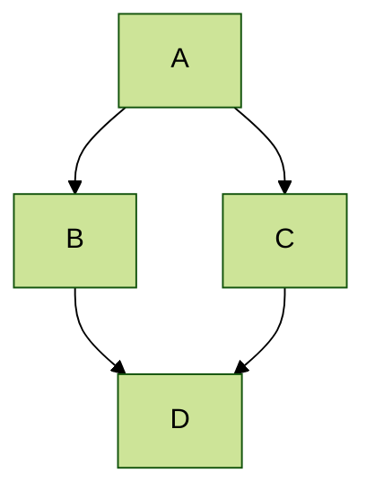



This is the front page of a website that is powered by the [Academic Pages template](https://github.com/academicpages/academicpages.github.io) and hosted on GitHub pages. [GitHub pages](https://pages.github.com) is a free service in which websites are built and hosted from code and data stored in a GitHub repository, automatically updating when a new commit is made to the repository. This template was forked from the [Minimal Mistakes Jekyll Theme](https://mmistakes.github.io/minimal-mistakes/) created by Michael Rose, and then extended to support the kinds of content that academics have: publications, talks, teaching, a portfolio, blog posts, and a dynamically-generated CV. Incidentally, these same features make it a great template for anyone that needs to show off a professional template!

 You can fork [this template](https://github.com/academicpages/academicpages.github.io) right now, modify the configuration and Markdown files, add your own PDFs and other content, and have your own site for free, with no ads!

A data-driven personal website
======
Like many other Jekyll-based GitHub Pages templates, Academic Pages makes you separate the website's content from its form. The content & metadata of your website are in structured Markdown files, while various other files constitute the theme, specifying how to transform that content & metadata into HTML pages. You keep these various Markdown (.md), YAML (.yml), HTML, and CSS files in a public GitHub repository. Each time you commit and push an update to the repository, the [GitHub pages](https://pages.github.com/) service creates static HTML pages based on these files, which are hosted on GitHub's servers free of charge.

Many of the features of dynamic content management systems (like Wordpress) can be achieved in this fashion, using a fraction of the computational resources and with far less vulnerability to hacking and DDoSing. You can also modify the theme to your heart's content without touching the content of your site. If you get to a point where you've broken something in Jekyll/HTML/CSS beyond repair, your Markdown files describing your talks, publications, etc. are safe. You can rollback the changes or even delete the repository and start over - just be sure to save the Markdown files! You can also write scripts that process the structured data on the site, such as [this one](https://github.com/academicpages/academicpages.github.io/blob/master/talkmap.ipynb) that analyzes metadata in pages about talks to display [a map of every location you've given a talk](https://academicpages.github.io/talkmap.html).

For those users that need more advanced functionality, the template also supports the following popular tools:
- [MathJax](https://www.mathjax.org/) for mathematical equations
- [Mermaid](https://mermaid.js.org/) for diagraming
- [Plotly](https://plotly.com/javascript/) for plotting

Getting started
======
1. Register a GitHub account if you don't have one and confirm your e-mail (required!)
1. Fork [this template](https://github.com/academicpages/academicpages.github.io) by clicking the "Use this template" button in the top right. 
1. Go to the repository's settings (rightmost item in the tabs that start with "Code", should be below "Unwatch"). Rename the repository "[your GitHub username].github.io", which will also be your website's URL.
1. Set site-wide configuration and create content & metadata (see below -- also see [this set of diffs](https://archive.is/3TPas) showing what files were changed to set up [an example site](https://getorg-testacct.github.io) for a user with the username "getorg-testacct")
1. Upload any files (like PDFs, .zip files, etc.) to the files/ directory. They will appear at https://[your GitHub username].github.io/files/example.pdf.  
1. Check status by going to the repository settings, in the "GitHub pages" section

Site-wide configuration
------
The main configuration file for the site is in the base directory in [_config.yml](https://github.com/academicpages/academicpages.github.io/blob/master/_config.yml), which defines the content in the sidebars and other site-wide features. You will need to replace the default variables with ones about yourself and your site's github repository. The configuration file for the top menu is in [_data/navigation.yml](https://github.com/academicpages/academicpages.github.io/blob/master/_data/navigation.yml). For example, if you don't have a portfolio or blog posts, you can remove those items from that navigation.yml file to remove them from the header. 

Create content & metadata
------
For site content, there is one Markdown file for each type of content, which are stored in directories like _publications, _talks, _posts, _teaching, or _pages. For example, each talk is a Markdown file in the [_talks directory](https://github.com/academicpages/academicpages.github.io/tree/master/_talks). At the top of each Markdown file is structured data in YAML about the talk, which the theme will parse to do lots of cool stuff. The same structured data about a talk is used to generate the list of talks on the [Talks page](https://academicpages.github.io/talks), each [individual page](https://academicpages.github.io/talks/2012-03-01-talk-1) for specific talks, the talks section for the [CV page](https://academicpages.github.io/cv), and the [map of places you've given a talk](https://academicpages.github.io/talkmap.html) (if you run this [python file](https://github.com/academicpages/academicpages.github.io/blob/master/talkmap.py) or [Jupyter notebook](https://github.com/academicpages/academicpages.github.io/blob/master/talkmap.ipynb), which creates the HTML for the map based on the contents of the _talks directory).

**Markdown generator**

The repository includes [a set of Jupyter notebooks](https://github.com/academicpages/academicpages.github.io/tree/master/markdown_generator
) that converts a CSV containing structured data about talks or presentations into individual Markdown files that will be properly formatted for the Academic Pages template. The sample CSVs in that directory are the ones I used to create my own personal website at stuartgeiger.com. My usual workflow is that I keep a spreadsheet of my publications and talks, then run the code in these notebooks to generate the Markdown files, then commit and push them to the GitHub repository.

How to edit your site's GitHub repository
------
Many people use a git client to create files on their local computer and then push them to GitHub's servers. If you are not familiar with git, you can directly edit these configuration and Markdown files directly in the github.com interface. Navigate to a file (like [this one](https://github.com/academicpages/academicpages.github.io/blob/master/_talks/2012-03-01-talk-1.md) and click the pencil icon in the top right of the content preview (to the right of the "Raw | Blame | History" buttons). You can delete a file by clicking the trashcan icon to the right of the pencil icon. You can also create new files or upload files by navigating to a directory and clicking the "Create new file" or "Upload files" buttons. 

Example: editing a Markdown file for a talk


For more info
------
More info about configuring Academic Pages can be found in [the guide](https://academicpages.github.io/markdown/), the [growing wiki](https://github.com/academicpages/academicpages.github.io/wiki), and you can always [ask a question on GitHub](https://github.com/academicpages/academicpages.github.io/discussions). The [guides for the Minimal Mistakes theme](https://mmistakes.github.io/minimal-mistakes/docs/configuration/) (which this theme was forked from) might also be helpful.


## Locations of key files/directories

* Basic config options: _config.yml
* Top navigation bar config: _data/navigation.yml
* Single pages: _pages/
* Collections of pages are .md or .html files in:
  * _publications/
  * _portfolio/
  * _posts/
  * _teaching/
  * _talks/
* Footer: _includes/footer.html
* Static files (like PDFs): /files/
* Profile image (can set in _config.yml): images/profile.png

## Tips and hints

* Name a file ".md" to have it render in markdown, name it ".html" to render in HTML.
* Go to the [commit list](https://github.com/academicpages/academicpages.github.io/commits/master) (on your repo) to find the last version GitHub built with Jekyll. 
  * Green check: successful build
  * Orange circle: building
  * Red X: error
  * No icon: not built

* Academic Pages uses [Jekyll Kramdown](https://jekyllrb.com/docs/configuration/markdown/), GitHub Flavored Markdown (GFM) parser, which is similar to the version of Markdown used on GitHub, but may have some minor differences. 
  * Some of emoji supported on GitHub should be supposed via the [Jemoji](https://github.com/jekyll/jemoji) plugin :computer:.
  * The best list of the supported emoji can be found in the [Emojis for Jekyll via Jemoji](https://www.fabriziomusacchio.com/blog/2021-08-16-emojis_for_Jekyll/#computer) blog post.

* While GitHub Pages prevents server side code from running, client-side scripts are supported.
  * This means that Google Analytics is supported, and [the wiki](https://github.com/academicpages/academicpages.github.io/wiki/Adding-Google-Analytics) should contain the most up-to-date information on getting it working.

* Your CV can be written using either Markdown ([preview](https://academicpages.github.io/cv/)) or generated via JSON ([preview](https://academicpages.github.io/cv-json/)) and the layouts are slightly different. You can update the path to the one being used in `_data/navigation.yml` with the JSON formatted CV being hidden by default.

 * The [Liquid syntax guide](https://shopify.github.io/liquid/tags/control-flow/) is a useful guide for those that want to add functionality to the template or to become contributors to the [template on GitHub](https://github.com/academicpages/academicpages.github.io).

## MathJax 

Support for MathJax (version 3.* via [jsDelivr](https://www.jsdelivr.com/), [documentation](https://docs.mathjax.org/en/latest/)) is included in the template:

$$
\displaylines{
\nabla \cdot E= \frac{\rho}{\epsilon_0} \\\
\nabla \cdot B=0 \\\
\nabla \times E= -\partial_tB \\\
\nabla \times B  = \mu_0 \left(J + \varepsilon_0 \partial_t E \right)
}
$$

The default delimiters of `$$...$$` and `\\[...\\]` are supported for displayed mathematics, while `\\(...\\)` should be used for in-line mathematics (ex., \\(a^2 + b^2 = c^2\\))

**Note** that since Academic Pages uses Markdown which cases some interference with MathJax and LaTeX for escaping characters and new lines, although [some workarounds exist](https://math.codidact.com/posts/278763/278772#answer-278772). In some cases, such as when you are including MathJax in a `citation` field for publications, it may be necessary to use `\(...\)` for inline delineation.

## Mermaid diagrams
Academic Pages includes support for [Mermaid diagrams](https://mermaid.js.org/) (version 11.* via [jsDelivr](https://www.jsdelivr.com/)) and in addition to their [tutorials](https://mermaid.js.org/ecosystem/tutorials.html) and [GitHub documentation](https://github.com/mermaid-js/mermaid) the basic syntax is as follows:

```markdown
    ```mermaid
    graph LR
    A-->B
    ```
```

Which produces the following plot with the [default theme](https://mermaid.js.org/config/theming.html) applied:


While a more advanced plot with the `forest` theme applied looks like the following:



## Plotly
Academic Pages includes support for Plotly diagrams via a hook in the Markdown code elements, although those that are comfortable with HTML and JavaScript can also access it [via those routes](https://plotly.com/javascript/getting-started/). Plotly is included via an `npm` [package](https://www.npmjs.com/package/plotly.js?activeTab=readme) and is distributed as part of the minimized JavaScript that is part of the template.

In order to render a Plotly plot via Markdown the relevant plot data need to be added as follows:

```markdown
    ```plotly
    {
      "data": [
        {
          "x": [1, 2, 3, 4],
          "y": [10, 15, 13, 17],
          "type": "scatter"
        },
        {
          "x": [1, 2, 3, 4],
          "y": [16, 5, 11, 9],
          "type": "scatter"
        }
      ]
    }
    ```
```

**Important!** Since the data is parsed as JSON *all* of the keys will need to be quoted for the plot to render. The use of a tool like [JSONLint](https://jsonlint.com/) to check syntax is highly recommended.
{: .notice}

Which produces the following:
```plotly
{
  "data": [
    {
      "x": [1, 2, 3, 4],
      "y": [10, 15, 13, 17],
      "type": "scatter"
    },
    {
      "x": [1, 2, 3, 4],
      "y": [16, 5, 11, 9],
      "type": "scatter"
    }
  ]
}
```

Essentially what is taking place is that the [Plotly attributes](https://plotly.com/javascript/reference/index/) are being taken from the code block as JSON data, parsed, and passed to Plotly along with a theme that matches the current site theme (i.e., a light theme, or a dark theme). This allows all plots that can be described via the `data` attribute to rendered with some limitations for the theme of the plot.

```plotly
{
  "data": [
    {
      "x": [1, 2, 3, 4, 5],
      "y": [1, 6, 3, 6, 1],
      "mode": "markers",
      "type": "scatter",
      "name": "Team A",
      "text": ["A-1", "A-2", "A-3", "A-4", "A-5"],
      "marker": { "size": 12 }
    },
    {
      "x": [1.5, 2.5, 3.5, 4.5, 5.5],
      "y": [4, 1, 7, 1, 4],
      "mode": "markers",
      "type": "scatter",
      "name": "Team B",
      "text": ["B-a", "B-b", "B-c", "B-d", "B-e"],
      "marker": { "size": 12 }
    }    
  ],
  "layout": {
    "xaxis": {
      "range": [ 0.75, 5.25 ]
    },
    "yaxis": {
      "range": [0, 8]
    },
    "title": {"text": "Data Labels Hover"}
  }
}
```

```plotly
{
  "data": [{
      "x": [1, 2, 3],
      "y": [4, 5, 6],
      "type": "scatter"
    },
    {
      "x": [20, 30, 40],
      "y": [50, 60, 70],
      "xaxis": "x2",
      "yaxis": "y2",
      "type": "scatter"
  }],
  "layout": {
    "grid": {
      "rows": 1,
      "columns": 2,
      "pattern": "independent"
    },
    "title": {
      "text": "Simple Subplot"
    }    
  }
}
```

```plotly
{
  "data": [{
		"z": [[10, 10.625, 12.5, 15.625, 20],
          [5.625, 6.25, 8.125, 11.25, 15.625],
          [2.5, 3.125, 5.0, 8.125, 12.5],
          [0.625, 1.25, 3.125, 6.25, 10.625],
          [0, 0.625, 2.5, 5.625, 10]],
		"type": "contour"
	}],
  "layout": {
    "title": {
      "text": "Basic Contour Plot"
    }
  }
}
```

## Markdown guide

Academic Pages uses [kramdown](https://kramdown.gettalong.org/index.html) for Markdown rendering, which has some differences from other Markdown implementations such as GitHub's. In addition to this guide, please see the [kramdown Syntax page](https://kramdown.gettalong.org/syntax.html) for full documentation.  

### Header three

#### Header four

##### Header five

###### Header six

## Blockquotes

Single line blockquote:

> Quotes are cool.

## Tables

### Table 1

| Entry            | Item   |                                                              |
| --------         | ------ | ------------------------------------------------------------ |
| [John Doe](#)    | 2016   | Description of the item in the list                          |
| [Jane Doe](#)    | 2019   | Description of the item in the list                          |
| [Doe Doe](#)     | 2022   | Description of the item in the list                          |

### Table 2

| Header1 | Header2 | Header3 |
|:--------|:-------:|--------:|
| cell1   | cell2   | cell3   |
| cell4   | cell5   | cell6   |
|-----------------------------|
| cell1   | cell2   | cell3   |
| cell4   | cell5   | cell6   |
|=============================|
| Foot1   | Foot2   | Foot3   |

## Definition Lists

Definition List Title
:   Definition list division.

Startup
:   A startup company or startup is a company or temporary organization designed to search for a repeatable and scalable business model.

#dowork
:   Coined by Rob Dyrdek and his personal body guard Christopher "Big Black" Boykins, "Do Work" works as a self motivator, to motivating your friends.

Do It Live
:   I'll let Bill O'Reilly [explain](https://www.youtube.com/watch?v=O_HyZ5aW76c "We'll Do It Live") this one.

## Unordered Lists (Nested)

  * List item one 
      * List item one 
          * List item one
          * List item two
          * List item three
          * List item four
      * List item two
      * List item three
      * List item four
  * List item two
  * List item three
  * List item four

## Ordered List (Nested)

  1. List item one 
      1. List item one 
          1. List item one
          2. List item two
          3. List item three
          4. List item four
      2. List item two
      3. List item three
      4. List item four
  2. List item two
  3. List item three
  4. List item four

## Buttons

Make any link standout more when applying the `.btn` class.

## Notices

Basic notices or call-outs are supported using the following syntax:

```markdown
**Watch out!** You can also add notices by appending `{: .notice}` to the line following paragraph.
{: .notice}
```

which wil render as:

**Watch out!** You can also add notices by appending `{: .notice}` to the line following paragraph.
{: .notice}

### Footnotes

Footnotes can be useful for clarifying points in the text, or citing information.[^1] Markdown support numeric footnotes, as well as text as long as the values are unique.[^note]

```markdown
This is the regular text.[^1] This is more regular text.[^note]

[^1]: This is the footnote itself.
[^note]: This is another footnote.
```

[^1]: Such as this footnote.
[^note]: When using text for footnotes markers, no spaces are permitted in the name.

## HTML Tags

### Address Tag

<address>
  1 Infinite Loop<br /> Cupertino, CA 95014<br /> United States
</address>

### Anchor Tag (aka. Link)

This is an example of a [link](https://github.com "GitHub").

### Abbreviation Tag

The abbreviation CSS stands for "Cascading Style Sheets".

*[CSS]: Cascading Style Sheets

### Cite Tag

"Code is poetry." ---<cite>Automattic</cite>

### Code Tag

You will learn later on in these tests that `word-wrap: break-word;` will be your best friend.

You can also write larger blocks of code with syntax highlighting supported for some languages, such as Python:

```python
print('Hello World!')
```

or R:

```R
print("Hello World!", quote = FALSE)
```

### Details Tag (collapsible sections)

The HTML `<details>` tag works well with Markdown and allows you to include collapsible sections, see [W3Schools](https://www.w3schools.com/tags/tag_details.asp) for more information on how to use the tag.

<details>
  <summary>Collapsed by default</summary>
  This section was collapsed by default!
</details>

The source code:

```HTML
<details>
  <summary>Collapsed by default</summary>
  This section was collapsed by default!
</details>
```

Or, you can leave a section open by default by including the `open` attribute in the tag:

<details open>
  <summary>Open by default</summary>
  This section is open by default thanks to open in the &lt;details open&gt; tag!
</details>


### Emphasize Tag

The emphasize tag should _italicize_ text.

### Insert Tag

This tag should denote <ins>inserted</ins> text.

### Keyboard Tag

This scarcely known tag emulates <kbd>keyboard text</kbd>, which is usually styled like the `<code>` tag.

### Preformatted Tag

This tag styles large blocks of code.

<pre>
.post-title {
  margin: 0 0 5px;
  font-weight: bold;
  font-size: 38px;
  line-height: 1.2;
  and here's a line of some really, really, really, really long text, just to see how the PRE tag handles it and to find out how it overflows;
}
</pre>

### Quote Tag

<q>Developers, developers, developers&#8230;</q> &#8211;Steve Ballmer

### Strike Tag

This tag will let you <strike>strikeout text</strike>.

### Strong Tag

This tag shows **bold text**.

### Subscript Tag

Getting our science styling on with H<sub>2</sub>O, which should push the "2" down.

### Superscript Tag

Still sticking with science and Isaac Newton's E = MC<sup>2</sup>, which should lift the 2 up.

### Variable Tag

This allows you to denote <var>variables</var>.

***
**Footnotes**

The footnotes in the page will be returned following this line, return to the section on <a href="#footnotes">Markdown Footnotes</a>.

